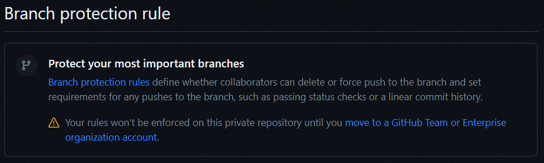
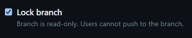
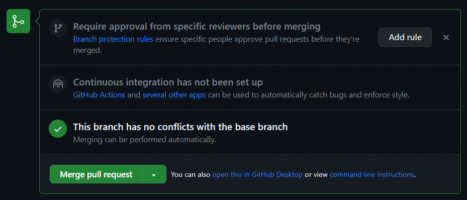
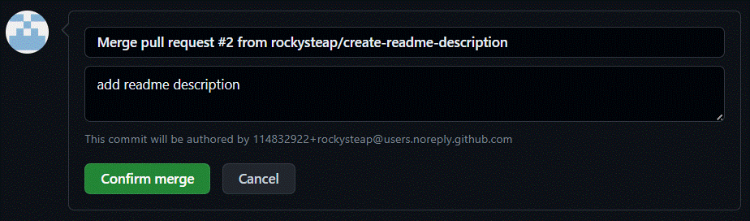
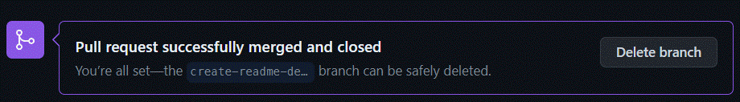
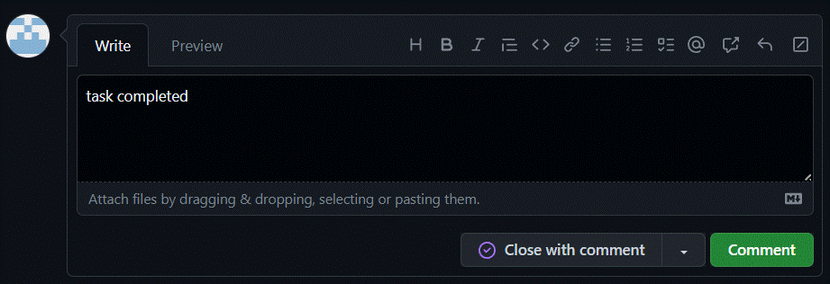

## Домашнее задание по уроку 3. 
## Практики и инструменты для работы с Git

### 1. Пригласите в свой проект кого-то из коллег по обучению, дайте им доступ к своему репозиторию (кроме ветки master).

    Создадим правило для защиты основной ветки

### 2. Поставьте ему в GitHub задачу по своему проекту, попросите её выполнить в отдельной ветке, а после выполнения — создать pull request и перевести задачу обратно на вас.

    Опишем новое задание (issue)
    Выберем исполнителя (assignee)

Создадим локально дополнительную ветку и выполним задачу. После выполнения сделаем push и создадим pull request.

### 3. Проверьте выполнение задачи, примите pull request и удалите ветку, в которой решалась данная задача.

    Проверим выполнение

    Объединим данные

    Удалим ветку

    Закроем задание (issue)

